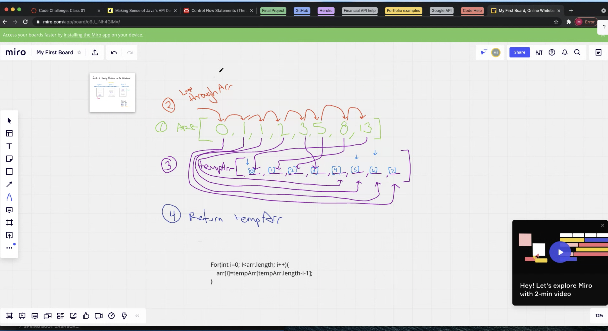

# data-structures-and-algorithims-2

## Reverse an Array

Reverse the contents of an array

## Challenge

Take an array of numbers and reverse the order of the numbers in the array.

## Approach & Efficiency

Made an array of numbers, and declared an empty array. Looped through the first array and saved the the value of the looped array to the new array at the index of negative one.

## Solution

## Singly Linked List

### Challenge
- Create a Node class that has properties for the value stored in the Node, and a pointer to the next Node. Within your LinkedList class, include a head property. -- Upon instantiation, an empty Linked List should be created.

- Define a method called insert which takes any value as an argument and adds a new node with that value to the head of the list with an O(1) Time performance.
- Define a method called includes which takes any value as an argument and returns a boolean result depending on whether that value exists as a Node’s value somewhere within the list.
- Define a method called toString (or str in Python) which takes in no arguments and returns a string representing all the values in the Linked List, formatted as: "{ a } -> { b } -> { c } -> NULL"

### Approach & Efficiency

### API
- Insert method that receives an int as input. Creates a new node at the position of head that carries the input value. If statement checks if the tail position is null, and if so creates another head in the list and assigns it a the value.
- Includes method takes in an int, and loops for as long as the current node is null. If the input value matches the value of the current node then the method returns true. If not, the loop tests the next node in the list. When the loop runs out of nodes to check and has not found it's match it returns false.
toString method takes in no arguments. It creates an empty string to serve as a vessel, and loops through the nodes in the list and adds the node values along with string concatenation for formatting to the empty string , and then returns the now filled string.

## Linked List Insertions

### Challenge
Write the following methods for the Linked List class:

- .append which adds a new node with the given value to the end of the list

- .insertBefore which add a new node with the given new value  before the first value node

- .insertAfter which add a new node with the given new value  after the first value node

### Aprroach and Efficiency

- Append: Looped through the linked-list, and while the target node has a value it moves to the next node. If the node is null then a new node is created in it's place posessing the value taken in by the method, and a new node of null is created and added to the end of the list.

- InsertBefore Looped through the linked-list while the current node is not null. If the next node in the list has a value that matches the input value then a new node carrying the new  value is created and put in the current nodes position in the list, and that node is moved down the list by one. 

- InsertAfter Looped through the linked-list while the current node is not null and if the next node in the list has a value that is the same as the input value then a new node carrying the new input value is created and put in the current node's position in the list and that node is moved up a postistion. 

## K-th value from the end of a linked list

### Description
Write a method for the Linked List class which takes a number, k, as a parameter. Return the node’s value that is k from the end of the linked list. You have access to the Node class and all the properties on the Linked List class as well as the methods created in previous challenges.

### Approach and efficiency
- Start with root node as pointer node and initialize index with 0;
- If  pointer node data equal to input data , then return the index value.
- If pointer node data is not equal to input data, increment index by one and update pointer node as next node.
- Continue the steps 2 and 3 end of the linked list.
- If data not found in linked list , return -1.

### Solution

