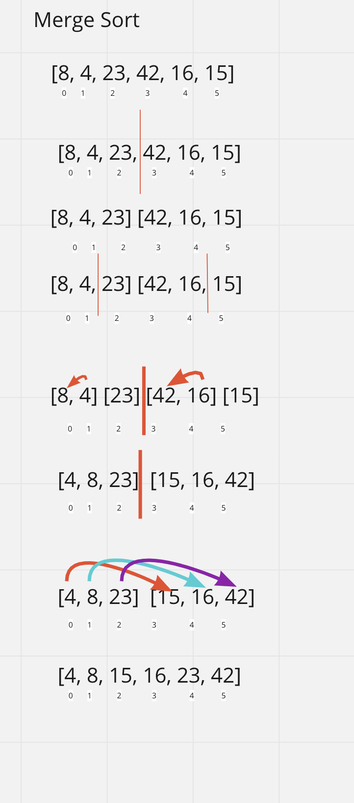

# Merge Sort
Merge Sort Works by cutting a list in half until it's down to just 1 elements in each list and then merging those together.

### Approach & Efficiency
Time: O(log(n))
Space: O(1)

### Solution

